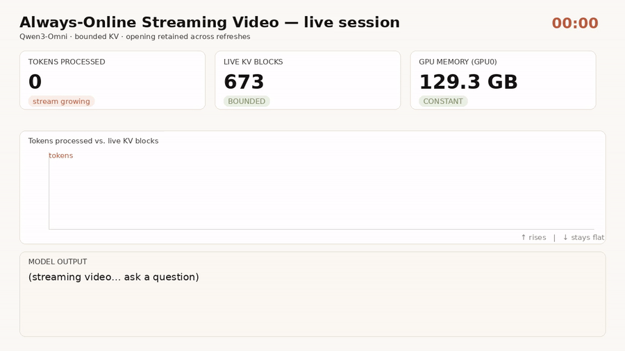

<!-- SPDX-License-Identifier: Apache-2.0 -->
<!-- SPDX-FileCopyrightText: Copyright contributors to the vLLM project -->

# Persistent Streaming-Video Session (Qwen3-Omni)

Always-online video understanding: a continuous video stream into Qwen3-Omni, text
answers out, **GPU memory bounded regardless of stream length**, and the stream's
**opening always recallable** across position-refreshes.

This is the `persistent` mode of the `/v1/video/chat/stream` WebSocket handler
(`vllm_omni/entrypoints/openai/serving_video_stream.py`). The default
`persistent: false` keeps the original windowed re-injection behavior; setting
`persistent: true` in the session config drives one engine streaming request that
ingests frames as input-only chunks (KV held flat by streaming-KV eviction, no
per-query re-prefill) and refreshes at the rotary-position boundary by re-seeding
`[opening + recent]`.

Open `assets/showcase.html` for a narrated walkthrough with an embedded ~45 s
recording of a live session (the recording is being re-captured on the v0.26.0
stack — see the validation report until it lands).



## What you'll see

| # | Signal | Where |
|---|--------|-------|
| 1 | **Current-moment tracking** — answer `(a)` changes as the video progresses | client output |
| 2 | **Opening retention** — answer `(b)` stays about the opening, across refreshes | client output |
| 3 | **Bounded memory** — KV `alive=N` stays flat while the stream grows | server log |
| 4 | **No crash** — clean `session.done`, refreshes appear as new request ids | client + server log |

Measured on 2×H200 (800-frame session, queries every 50 frames; S2 = eager run,
S3 = CUDA-graphs run of the v0.26.0 validation):

| Metric | old branch (v0.20-era) | this port (v0.26.0) |
|--------|------------------------|---------------------|
| ingestion (session e2e incl. answers) | ~25 frames/s (**~12× a live 2 fps feed**) | **25.5 frames/s** graphs / ~13 frames/s eager |
| query cycle (50-frame ingest + answer) | ~1.5 s query latency | **~1.4 s** graphs / 2.8–4.3 s eager |
| decode | ~35 tok/s eager → ~199 tok/s graphs | 26.5 tok/s eager → **213 tok/s** graphs (per-answer median) |
| KV `alive` | 672–673 | **672–673** (flat across 10 epochs) |
| server ready | — | 182 s eager / **222 s** graphs (torch.compile ~39 s + capture ≤2 s per stage) |

A single server also sustains **concurrent** persistent sessions once
`--max-num-seqs` is raised (validated up to 8 streams; see the validation
report's S4 scaling table).

## Requirements

- **2 GPUs**, enough memory for `Qwen3-Omni-30B-A3B-Instruct` (validated on 2×H200). The
  omni server places stages across the two GPUs — do **not** pass `--tensor-parallel-size`.
- **vLLM v0.26.0 with the streaming-KV overlay.** The eviction (`--streaming-kv-*`) that
  bounds the cache, plus a per-chunk `max_tokens` scheduler fix the persistent mode needs,
  live on [`Arsene12358/vllm@feat/streaming-kv-v026`](https://github.com/Arsene12358/vllm/tree/feat/streaming-kv-v026).
  The changes are pure-Python over the `v0.26.0` release, so the quickest path is to install
  the wheel and overlay the branch's changed files:
  ```bash
  pip install vllm==0.26.0
  git clone -b feat/streaming-kv-v026 https://github.com/Arsene12358/vllm.git vllm-fork
  SITE=$(python -c "import vllm,os; print(os.path.dirname(vllm.__file__))")
  ( cd vllm-fork && git fetch --no-tags https://github.com/vllm-project/vllm.git tag v0.26.0 >/dev/null 2>&1
    for f in $(git diff --name-only v0.26.0..HEAD -- 'vllm/**/*.py'); do
      rel=${f#vllm/}; mkdir -p "$SITE/$(dirname "$rel")"; cp "$f" "$SITE/$rel"; done )
  ```
- **This vLLM-Omni checkout** (the `feat/persistent-video-session-v026` branch, with the
  persistent handler) installed from source:
  ```bash
  git clone -b feat/persistent-video-session-v026 https://github.com/Arsene12358/vllm-omni.git
  cd vllm-omni && pip install -e .
  ```
- Client deps: `pip install websockets pillow` (frame reading uses `vllm.assets.video`,
  or falls back to `opencv-python`).

## Run the demo

```bash
# 1) serve (one terminal)
MODEL=Qwen/Qwen3-Omni-30B-A3B-Instruct PORT=8901 ./run_server.sh
# wait until http://localhost:8901/v1/models returns a model id
# (first load ~4 min: weights + torch.compile + CUDA-graph capture)

# 2) stream a clip + ask questions (another terminal)
python demo_client.py --video your_clip.mp4 --port 8901 \
    --frames 800 --query-every 50 --refresh-at 2000 --sink 6 --recent 10
# add --brief for tight two-sentence answers
```

Expected: `(a)` answers evolve with the video, `(b)` answers keep describing the same
opening, and the run ends `RESULT: PASS`. Then confirm bounded memory + refreshes in the
server output:

```bash
grep "streaming-kv" server.log | grep -oE "alive=[0-9]+" | sort -u          # tight band, e.g. 672-673
grep -oE "vsess-[a-f0-9]+-[0-9]+" server.log | sed -E 's/.*-([0-9]+)$/\1/' | sort -nu  # 0,1,2,.. = refreshes
```

## Reproduce the recording (`assets/recording.mp4`)

```bash
./run_server.sh > server.log 2>&1 &                 # serve, logging to a file
./monitor.sh server.log >> capture.log &            # sample GPU mem + KV alive @1s
VIDEO_PATH=your_clip.mp4 python capture_client.py >> capture.log   # stream + brief queries
./render_demo.py capture.log --out recording.mp4 --gif             # PIL + ffmpeg dashboard
```

`render_demo.py` draws tokens-processed climbing while the live KV working set and GPU
memory stay flat, with the model's answers and refresh markers. Needs `ffmpeg` + `pillow`.

## Config / tuning knobs

| Knob | Where | Effect |
|------|-------|--------|
| `sink_frames` (`--sink`) | session config | opening frames pinned + re-seeded each epoch (the retained opening) |
| `num_frames` (`--recent`) | session config | recent frames re-seeded at a refresh for continuity |
| `refresh_at_position` (`--refresh-at`, ≥1024) | session config | larger → longer epochs / fewer refreshes (keep epoch tokens < `max-model-len`) |
| `--streaming-kv-start-size` / `-recent-size` | server | KV tokens pinned (opening) / kept (recent) — the memory bound |
| `--max-num-seqs` | server | concurrent persistent sessions per server; the demo default `1` keeps single-viewer latency, `8` validated with 8 concurrent streams on 2×H200 (each stream keeps its own flat 672–673 KV band) |
| `system_prompt` (`--brief`) | session config | brevity instruction for clean two-sentence answers |
| `persistent: false` | session config | the original windowed re-injection handler (unchanged) |

One epoch accumulates about `refresh_at_position / 40` video items in a single request (40 is the driver's per-chunk M-RoPE position estimate), so keep `refresh_at_position / 40` at or below the server's `--limit-mm-per-prompt` video limit. The shipped pair is safe: `--refresh-at 2000` → ~50 items against `--limit-mm-per-prompt '{"video": 256}'`. Raise the server limit before raising `--refresh-at`.

## Troubleshooting

- **Streaming session wedges mid-stream under `--enforce-eager`** — eager + the default
  async scheduling is a broken combination for persistent streaming sessions. If you must
  run eager, set `async_scheduling: false` on stages 0 and 1 **through a deploy config**
  (`--deploy-config your.yaml`): the deploy value picks the sync scheduler class and the
  engine arg together. The `--no-async-scheduling` CLI flag is **not** sufficient — it
  flips only the engine arg while the stage keeps the async scheduler class resolved from
  the deploy YAML (an untested mismatch). The default CUDA-graphs config (this
  `run_server.sh`) needs no override.
- **Server aborts with `local_world_size (2) > visible devices (1)`** — you passed
  `--tensor-parallel-size`; remove it (the omni server self-places stages).
- **Queries return one word / stop immediately** — the vLLM-core `max_tokens` scheduler
  fix isn't applied; re-check the streaming-KV overlay recipe above.
- **Multi-modal limit error mid-stream** — raise `--limit-mm-per-prompt '{"video": N}'`.
- **Verbose "Detailed Breakdown" tail** — base-model behavior; use `--brief`. Not a mechanic issue.

## Files

| File | Purpose |
|------|---------|
| `run_server.sh` | serve Qwen3-Omni with the persistent-mode flags |
| `demo_client.py` | interactive demo: stream a clip, ask questions, verify the 4 signals |
| `capture_client.py` | recording: stream + brief queries, timestamped answer events |
| `monitor.sh` | recording: sample GPU-0 memory + live KV blocks @1s |
| `render_demo.py` | recording: render the captured timeline to MP4/GIF |
| `assets/showcase.html` | narrated walkthrough with the embedded recording (re-captured on the v0.26.0 stack) |
| `assets/recording.mp4` / `.gif` | the captured ~45 s segment (re-captured on the v0.26.0 stack) |
